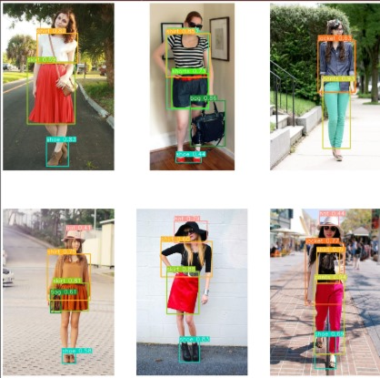
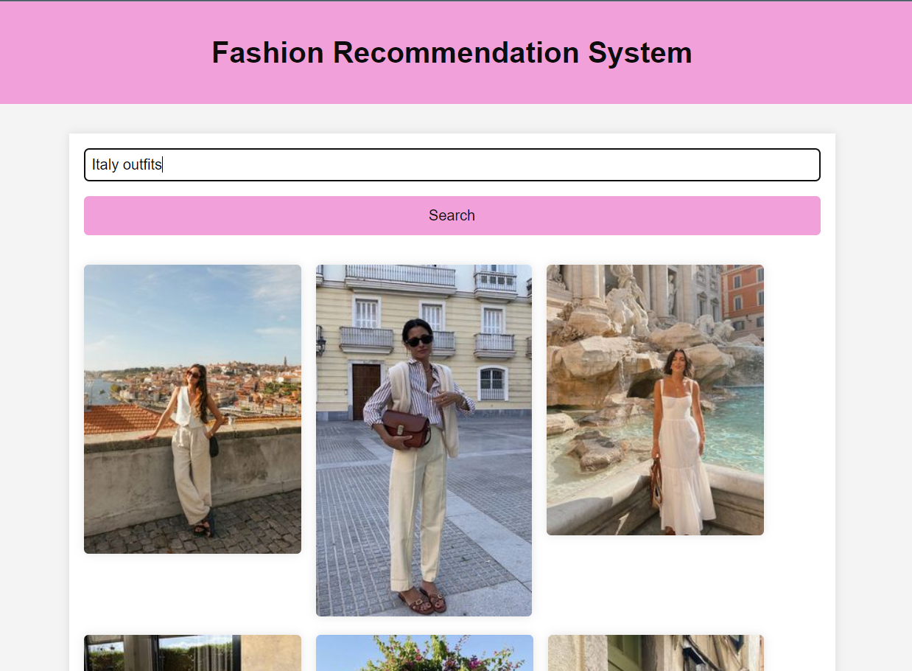
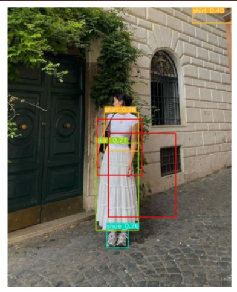

# Outfito - AI-Driven Fashion Recommendation System

## Overview
Outfito is an AI-driven fashion recommendation system tailored for travelers. It integrates Pinterest for fashion inspiration and Myntra for seamless shopping, providing users with stylish and destination-appropriate outfit recommendations.

## Features
- **AI-Powered Image Recognition:** Utilizes deep learning models for accurate identification of fashion styles and items from user-provided images or Pinterest inspirations.
- **Pinterest Integration:** Leverages Pinterest API to fetch and analyze fashion trends and styles based on destination keywords or user inputs.
- **Myntra Integration:** Direct integration with Myntra's catalog enables users to view and purchase recommended outfits and accessories effortlessly.

## Demo
Here's a quick demo of how Outfito works:

